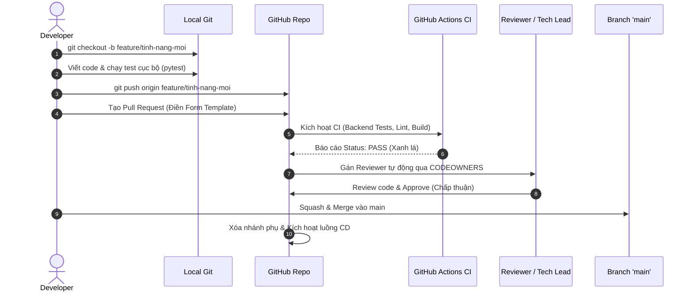

# 📘 Hướng Dẫn Quy Trình Phát Triển & Đóng Góp Mã Nguồn (Team Development Guide)

Tài liệu này áp dụng bắt buộc cho **toàn bộ 5 thành viên nhóm phát triển dự án Oculide v1**. Mục tiêu là bảo vệ độ ổn định của nhánh chính (`main`), loại bỏ xung đột mã nguồn và tự động hóa tối đa quy trình làm việc.

---

## 🌳 1. Chiến Lược Phân Nhánh (Branching Strategy - GitHub Flow)

Nhánh `main` là nhánh nguồn chân lý (Source of Truth), đại diện cho mã nguồn sẵn sàng chạy trên môi trường thực tế (Production). 
**Tuyệt đối không ai (kể cả Tech Lead) được phép push code trực tiếp hoặc force-push lên nhánh `main`.**

Mọi công việc phải xuất phát từ một nhánh phụ với tiền tố quy ước:

| Tiền tố nhánh | Mục đích sử dụng | Ví dụ đặt tên |
| :--- | :--- | :--- |
| `feature/` | Phát triển một chức năng hoàn toàn mới | `feature/anti-idor-sessions`, `feature/camera-grid` |
| `bugfix/` | Sửa lỗi phát sinh trong quá trình kiểm thử | `bugfix/stuck-grading-timeout`, `bugfix/redis-reconnect` |
| `hotfix/` | Sửa lỗi khẩn cấp trực tiếp cho Production | `hotfix/jwt-expiration-error`, `hotfix/db-pool-exhausted` |
| `refactor/`| Cải tiến cấu trúc, tối ưu hiệu năng (không đổi logic) | `refactor/dal-scoreboard`, `refactor/docker-sandbox` |

---

## 💬 2. Quy Chuẩn Commit Message (Conventional Commits)

Toàn bộ commit và tiêu đề Pull Request bắt buộc tuân thủ định dạng chuẩn quốc tế:

$$\text{type(scope): description}$$

### Các kiểu commit hợp lệ:
* `feat`: Thêm tính năng mới (ví dụ: `feat(auth): implement refresh token rotation`)
* `fix`: Sửa lỗi hệ thống (ví dụ: `fix(grader): resolve C++ compilation timeout`)
* `refactor`: Tái cấu trúc code (ví dụ: `refactor(database): optimize connection pool settings`)
* `perf`: Tối ưu hóa hiệu năng (ví dụ: `perf(ai): drop duplicate video frames`)
* `test`: Bổ sung hoặc sửa đổi bài test (ví dụ: `test(self-healing): add watchdog recovery tests`)
* `docs`: Cập nhật tài liệu (ví dụ: `docs(api): update OpenAPI schemas in README`)
* `chore` / `ci`: Thay đổi cấu hình build, CI/CD (ví dụ: `ci(actions): add parallel backend and frontend jobs`)

> [!NOTE]
> Hệ thống GitHub Action [`pr-lint.yml`](file:///.github/workflows/pr-lint.yml) sẽ tự động kiểm tra tiêu đề PR. Nếu viết sai định dạng (ví dụ: "fix bug", "update code"), nút Merge sẽ bị khóa tự động.

---

## 🔄 3. Quy Trình 7 Bước Làm Việc (Standard Pull Request Lifecycle)



### Chi tiết các bước:
1. **Tạo nhánh:** Luôn pull code mới nhất từ `main` trước khi rẽ nhánh:
   ```bash
   git checkout main
   git pull origin main
   git checkout -b feature/ten-chuc-nang
   ```
2. **Kiểm thử cục bộ (Pre-flight Check):** Trước khi commit, phải đảm bảo toàn bộ bộ test cục bộ đều xanh:
   ```bash
   pytest backend/tests/
   ```
3. **Commit & Push:** Đặt tên commit theo chuẩn `type(scope): description`.
4. **Mở Pull Request:** 
   - Điền đầy đủ form mẫu tự động hiển thị trong PR ([`.github/pull_request_template.md`](file:///.github/pull_request_template.md)).
   - Bắt buộc ghi từ khóa đóng Issue: `Closes #15` hoặc `Fixes #22`.
5. **Xét duyệt mã nguồn (Code Review):**
   - Cần tối thiểu **1 chấp thuận (Approve)** từ thành viên khác trong nhóm.
   - Nếu PR chạm vào file nhạy cảm (`database/schema.sql`, `backend/core/security.py`, `docker-compose.yml`), GitHub sẽ yêu cầu đích danh **Tech Lead** phê duyệt (theo cấu hình [`CODEOWNERS`](file:///.github/CODEOWNERS)).
6. **Giải quyết phản hồi (Resolve Conversations):** Mọi thắc mắc, phản biện của reviewer phải được giải quyết dứt điểm.
7. **Squash and Merge:** Gộp toàn bộ commit vụn vặt của nhánh thành 1 commit duy nhất chuẩn mực trên nhánh `main`.

---

## 🛡️ 4. Quy Tắc Bảo Vệ Nhánh Cần Bật Trên GitHub (Branch Protection Rules)

Sau khi đưa các file này lên repository, Tech Lead truy cập vào **Settings > Branches > Add branch protection rule** cho nhánh `main`:

* [x] **Require a pull request before merging:**
  * [x] **Require approvals:** Đặt là `1` người.
  * [x] **Dismiss stale pull request approvals when new commits are pushed** (Hủy duyệt cũ nếu có code mới đẩy thêm).
  * [x] **Require review from Code Owners** (Bắt buộc chủ sở hữu file duyệt).
* [x] **Require status checks to pass before merging:**
  * [x] Chọn `Backend Tests & Coverage`
  * [x] Chọn `Frontend Lint & Build`
  * [x] Chọn `Validate Conventional Commits PR Title`
* [x] **Require conversation resolution before merging:** Bắt buộc giải quyết hết comment mới được merge.
* [x] **Do not allow bypassing the above settings:** Áp dụng cho cả Quản trị viên (Admin/Maintainer).
