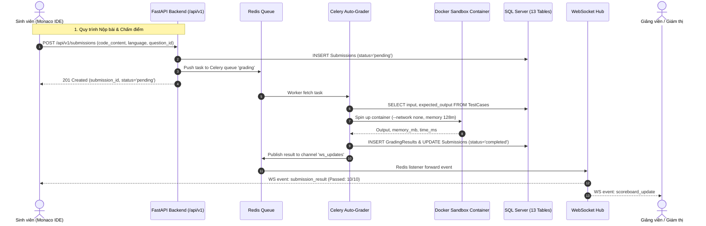

# 📘 Oculide v1 - Tài Liệu Thiết Kế Kiến Trúc API (API Design Specification)

Tài liệu này xác định chuẩn thiết kế hệ thống **RESTful API** và giao thức **WebSocket Real-time** cho nền tảng **Oculide v1 (Laboratory Monitoring & AI Proctoring System)**. Thiết kế được nâng cấp và tái cấu trúc từ phiên bản Oculide tiền nhiệm, chuẩn hóa toàn diện theo chuẩn phiên bản `/api/v1`, đồng bộ 100% với cấu trúc 13 bảng CSDL mới và tương thích tối đa với Frontend Next.js 14.

---

## 1. Nguyên Tắc & Quy Ước Thiết Kế Chung

### 1.1 Base URL & Versioning
- Mọi tài nguyên RESTful API được đặt dưới tiền tố thống nhất:
  ```http
  https://api.oculide.id.vn/api/v1
  ```
  *(Môi trường phát triển cục bộ: `http://localhost:8000/api/v1`)*

### 1.2 HTTP Methods & Semantic Status Codes
| Phương thức | Ý nghĩa sử dụng | Mã phản hồi thành công | Mã lỗi phổ biến |
|---|---|---|---|
| **GET** | Truy vấn lấy thông tin tài nguyên | `200 OK` | `404 Not Found`, `401`, `403` |
| **POST** | Tạo mới tài nguyên / Thao tác xử lý nghiệp vụ | `201 Created` / `202 Accepted` | `400 Bad Request`, `422 Unprocessable Entity` |
| **PUT** | Cập nhật toàn bộ thông tin tài nguyên | `200 OK` | `400`, `404`, `422` |
| **PATCH** | Cập nhật một phần trạng thái (Status, Review) | `200 OK` | `400`, `404`, `422` |
| **DELETE** | Xóa tài nguyên khỏi hệ thống | `204 No Content` / `200 OK` | `404`, `403` |

### 1.3 Chuẩn Phản Hồi (API Response Envelope)
Mọi phản hồi lỗi hoặc xử lý nghiệp vụ đều có cấu trúc JSON rõ ràng:

```json
{
  "success": false,
  "error": {
    "code": "ROOM_ACCESS_DENIED",
    "message": "Mật khẩu phòng thi (passcode) không chính xác.",
    "details": null
  }
}
```

Đối với phản hồi danh sách có phân trang (Pagination):
```json
{
  "items": [],
  "total": 120,
  "page": 1,
  "size": 20,
  "pages": 6
}
```

### 1.4 Cơ Chế Xác Thực & Phân Quyền (Authentication & RBAC)
- **Chuẩn xác thực:** Stateless JWT (JSON Web Token) truyền qua Request Header:
  ```http
  Authorization: Bearer <access_token>
  ```
- **Hệ thống 3 Role chính:**
  - `admin`: Toàn quyền quản trị hệ thống, người dùng, phân quyền và cấu hình server.
  - `instructor`: Tạo & quản lý phòng (`Rooms`), ngân hàng đề thi (`Questions`, `TestCases`), duyệt kết quả (`GradingResults`), theo dõi Lưới giám sát (Panoptic Grid View) và duyệt vi phạm (`Violations`).
  - `student`: Ghi danh tham gia phòng, làm bài thi trên Monaco IDE, chạy thử code (`/run`), nộp bài chính thức (`Submissions`), truyền video camera giám sát WebRTC.

---

## 2. Ma Trận Ánh Xạ CSDL 13 Bảng & RESTful Resources

| Tên Bảng CSDL Mới | REST Resource URI | Chức năng nghiệp vụ tương ứng |
|---|---|---|
| **`Users`** | `/api/v1/auth`, `/api/v1/admin/users` | Quản lý tài khoản, đăng nhập, phân quyền, hồ sơ cá nhân |
| **`Rooms`** | `/api/v1/rooms` | Quản lý phòng thi và phòng thực hành lớp học |
| **`Questions`** | `/api/v1/questions` | Ngân hàng đề bài, câu hỏi lập trình và cấu hình giới hạn |
| **`TestCases`** | `/api/v1/questions/{id}/test-cases` | Bộ dữ liệu kiểm thử tự động (Công khai / Ẩn chấm điểm) |
| **`Enrollments`** | `/api/v1/rooms/{id}/enrollments` | Danh sách sinh viên được cấp quyền tham gia phòng |
| **`Submissions`** | `/api/v1/submissions` | Quản lý bài nộp code của sinh viên qua các lần nộp |
| **`GradingResults`**| `/api/v1/submissions/{id}/results`| Chi tiết điểm số từng test case từ Docker Sandbox Auto-Grader |
| **`Sessions`** | `/api/v1/sessions` | Phiên kết nối làm bài, theo dõi hiện diện và kết thúc bài thi |
| **`Violations`** | `/api/v1/violations` | Nhật ký vi phạm phát hiện bởi YOLOv8 & MediaPipe & Browser |
| **`Snapshots`** | `/api/v1/violations/snapshots` | Ảnh chụp webcam định kỳ phục vụ AI phân tích gian lận |
| **`Messages`** | `/api/v1/chat` | Trao đổi tin nhắn thông báo chung và chat riêng với giám thị |
| **`SystemLogs`** | `/api/v1/admin/logs` | Audit log và nhật ký vận hành kỹ thuật hệ thống |
| **`LiveKitTokens`**| `/api/v1/livekit/tokens` | Cấp quyền kết nối truyền luồng video qua LiveKit SFU |

---

## 3. Chi Tiết Các Phân Hệ Endpoints (API Specification)

### 3.1 Authentication API (`/api/v1/auth`)

| Endpoint | Method | Role | Mô tả chức năng |
|---|---|---|---|
| `/register` | `POST` | Public | Đăng ký tài khoản người dùng mới |
| `/login` | `POST` | Public | Đăng nhập tài khoản bằng `username`/`password`, nhận JWT Access Token |
| `/me` | `GET` | Authenticated | Lấy thông tin chi tiết tài khoản của người dùng hiện tại |
| `/join` | `POST` | Student | Tham gia phòng nhanh bằng `room_code` và `passcode` (cấp Token tạm thời) |
| `/login/google` | `GET` | Public | Khởi tạo luồng xác thực Google OAuth2 |
| `/callback/google`| `GET` | Public | Tiếp nhận redirect code từ Google OAuth2 |
| `/login/github` | `GET` | Public | Khởi tạo luồng xác thực GitHub OAuth |
| `/callback/github`| `GET` | Public | Tiếp nhận redirect code từ GitHub OAuth |
| `/profile` | `PUT` | Authenticated | Cập nhật thông tin cá nhân (Họ tên, email, avatar) |
| `/change-password`| `PUT` | Authenticated | Đổi mật khẩu tài khoản người dùng |

### 3.2 Admin Management API (`/api/v1/admin`)

| Endpoint | Method | Role | Mô tả chức năng |
|---|---|---|---|
| `/users` | `GET` | Admin | Lấy danh sách người dùng hệ thống có tìm kiếm, lọc theo role và phân trang |
| `/users` | `POST` | Admin | Tạo tài khoản người dùng mới (chỉ định role trực tiếp) |
| `/users/{id}` | `GET` | Admin | Lấy thông tin chi tiết người dùng theo ID |
| `/users/{id}/status`| `PUT` | Admin | Khóa hoặc kích hoạt tài khoản người dùng (`is_active: 0 / 1`) |
| `/users/{id}/role` | `PUT` | Admin | Thay đổi phân quyền tài khoản (`admin`, `instructor`, `student`) |
| `/users/{id}/reset-password`| `POST`| Admin | Đặt lại mật khẩu tài khoản về mật khẩu ngẫu nhiên |
| `/users/{id}` | `DELETE`| Admin | Xóa tài khoản người dùng khỏi hệ thống |
| `/users/batch-import`| `POST` | Admin | Nhập danh sách sinh viên theo lô bằng file CSV hoặc JSON |
| `/system/overview`| `GET` | Admin | Thống kê số lượng phòng đang chạy, CPU/RAM, kết nối active |

### 3.3 Rooms Management API (`/api/v1/rooms`)

| Endpoint | Method | Role | Mô tả chức năng |
|---|---|---|---|
| `/` | `POST` | Instructor, Admin | Tạo mới phòng học (`classroom`) hoặc phòng thi (`exam`) |
| `/` | `GET` | Authenticated | Lấy danh sách phòng (Giảng viên: phòng tự tạo; Sinh viên: phòng đã ghi danh) |
| `/public/{code}` | `GET` | Public | Lấy thông tin công khai của phòng qua `room_code` (tên, thời gian, yêu cầu passcode) |
| `/{id}` | `GET` | Authenticated | Lấy thông tin chi tiết cấu hình phòng theo `room_id` |
| `/{id}` | `PUT` | Instructor, Admin | Cập nhật cấu hình phòng (thời gian, thời lượng, số lần nộp, passcode, trạng thái) |
| `/{id}` | `DELETE`| Instructor, Admin | Xóa phòng thi/học |
| `/{id}/dashboard`| `GET` | Instructor, Admin | Lấy dữ liệu Panoptic Grid View tổng hợp (sinh viên online, webcam stream, cảnh báo vi phạm) |
| `/{id}/scoreboard`| `GET` | Instructor, Admin | Bảng điểm thời gian thực tổng hợp kết quả của toàn bộ sinh viên trong phòng |
| `/{id}/config` | `GET` | Authenticated | Lấy cấu hình runtime môi trường phòng (chế độ kiểm soát, danh sách ngôn ngữ cho phép) |
| `/{id}/enrollments`| `GET` | Instructor, Admin | Lấy danh sách sinh viên được phân bổ trong phòng |
| `/{id}/enrollments`| `POST` | Instructor, Admin | Ghi danh một hoặc nhiều sinh viên vào phòng |
| `/{id}/enrollments/{student_id}` | `DELETE` | Instructor, Admin | Xóa sinh viên khỏi danh sách phòng |

### 3.4 Questions & Test Cases API (`/api/v1/questions`)

| Endpoint | Method | Role | Mô tả chức năng |
|---|---|---|---|
| `/` | `POST` | Instructor, Admin | Tạo câu hỏi/đề bài mới trong phòng |
| `/room/{room_id}` | `GET` | Authenticated | Lấy danh sách câu hỏi trong phòng (Sinh viên ẩn test cases bí mật) |
| `/{id}` | `GET` | Authenticated | Lấy chi tiết nội dung đề bài, giới hạn thời gian/bộ nhớ và sample test cases |
| `/{id}` | `PUT` | Instructor, Admin | Chỉnh sửa nội dung câu hỏi, điểm tối đa, cấu hình giới hạn |
| `/{id}` | `DELETE` | Instructor, Admin | Xóa câu hỏi khỏi đề thi |
| `/{id}/test-cases` | `GET` | Instructor, Admin | Lấy toàn bộ danh sách test cases (bao gồm test cases ẩn chấm điểm) |
| `/{id}/test-cases` | `POST` | Instructor, Admin | Thêm mới test case cho câu hỏi (quy định input, output, điểm, cờ `is_hidden`) |
| `/{id}/test-cases/{tc_id}` | `PUT` | Instructor, Admin | Cập nhật nội dung hoặc điểm test case |
| `/{id}/test-cases/{tc_id}` | `DELETE` | Instructor, Admin | Xóa test case |

### 3.5 Submissions & Code Execution API (`/api/v1/submissions`)

| Endpoint | Method | Role | Mô tả chức năng |
|---|---|---|---|
| `/` | `POST` | Student | Nộp bài làm chính thức. Đẩy task vào hàng đợi Redis để Docker Sandbox chấm điểm |
| `/run` | `POST` | Student, Instructor| Chạy thử code tức thì với dữ liệu nhập tùy biến (`custom_input`), không tính điểm |
| `/{id}` | `GET` | Authenticated | Lấy chi tiết bài nộp mã nguồn, trạng thái chấm điểm và tổng điểm |
| `/{id}/results` | `GET` | Authenticated | Lấy chi tiết kết quả chạy qua từng test case (thời gian chạy, output, pass/fail) |
| `/student/{student_id}` | `GET` | Authenticated | Lịch sử bài nộp của một sinh viên trong phòng |
| `/question/{question_id}` | `GET` | Instructor, Admin | Lấy toàn bộ bài nộp của tất cả sinh viên cho câu hỏi chỉ định |
| `/{id}/status` | `PATCH` | Instructor, Admin | Can thiệp cập nhật thủ công trạng thái bài nộp (`completed`, `failed`) |

### 3.6 Exam & Practice Sessions API (`/api/v1/sessions`)

| Endpoint | Method | Role | Mô tả chức năng |
|---|---|---|---|
| `/` | `POST` | Student | Khởi tạo phiên tham gia phòng thi (lưu IP, User-Agent, browser fingerprint) |
| `/room/{room_id}` | `GET` | Instructor, Admin | Lấy danh sách toàn bộ phiên của các sinh viên trong phòng thi |
| `/student/{student_id}` | `GET` | Authenticated | Lấy lịch sử các phiên thi của sinh viên |
| `/{id}` | `GET` | Authenticated | Lấy chi tiết phiên làm bài hiện tại |
| `/{id}/status` | `PATCH` | Authenticated | Cập nhật trạng thái phiên (`active`, `completed`, `terminated`, `abandoned`) |
| `/{id}/end` | `POST` | Student, Instructor| Kết thúc phiên thi chính thức (tính thời gian hoàn thành, khóa nộp bài) |

### 3.7 AI Proctoring & Violations API (`/api/v1/violations`)

| Endpoint | Method | Role | Mô tả chức năng |
|---|---|---|---|
| `/` | `POST` | Authenticated | Ghi nhận một bản ghi vi phạm (Browser event: tab switch, blur, exit fullscreen) |
| `/analyze` | `POST` | Authenticated | Tiếp nhận ảnh chụp snapshot webcam, đẩy vào hàng đợi Celery AI Worker phân tích |
| `/session/{session_id}` | `GET` | Instructor, Admin | Danh sách các vi phạm phát hiện trong một phiên thi cụ thể |
| `/student/{student_id}` | `GET` | Instructor, Admin | Thống kê vi phạm của sinh viên trong phòng |
| `/{id}/review` | `PATCH` | Instructor, Admin | Giảng viên xác nhận hoặc hạ mức cảnh báo vi phạm (`is_reviewed: 1`) |
| `/room/{room_id}/stats` | `GET` | Instructor, Admin | Thống kê số lượng vi phạm theo từng loại (điện thoại, mất mặt, chuyển tab) |

### 3.8 LiveKit Video Streaming API (`/api/v1/livekit`)

| Endpoint | Method | Role | Mô tả chức năng |
|---|---|---|---|
| `/tokens` | `POST` | Authenticated | Phát sinh Access Token kết nối LiveKit SFU (quy định Identity và Room) |
| `/rooms` | `POST` | Instructor, Admin | Khởi tạo phòng truyền phát video trên LiveKit Server |
| `/rooms` | `GET` | Instructor, Admin | Danh sách các phòng video stream đang hoạt động |
| `/rooms/{room_name}` | `GET` | Instructor, Admin | Lấy danh sách người tham gia (Participants) và các track video/audio đang stream |
| `/rooms/{room_name}` | `DELETE`| Instructor, Admin | Đóng phòng video stream khi buổi học/thi kết thúc |

### 3.9 Real-time Chat API (`/api/v1/chat`)

| Endpoint | Method | Role | Mô tả chức năng |
|---|---|---|---|
| `/` | `POST` | Authenticated | Gửi tin nhắn mới vào phòng (lưu CSDL bảng `Messages`) |
| `/room/{room_id}` | `GET` | Authenticated | Lấy lịch sử các tin nhắn thông báo chung trong phòng |
| `/conversation/{user_id}`| `GET` | Authenticated | Lấy lịch sử hội thoại riêng giữa sinh viên và giảng viên |

---

## 4. Giao Thức WebSocket Real-Time (`/ws/{room_id}/{user_id}`)

### 4.1 Cơ Chế Kết Nối
- Sinh viên kết nối với định danh: `user_id = "{student_id}"`
- Giám thị kết nối với định danh: `user_id = "proctor_{instructor_id}"`

### 4.2 Các Gói Tin Định Dạng JSON Chuẩn
1. **Thông báo Vi phạm Thời Gian Thực (`proctoring_violation`):**
   *Nguồn phát: AI Worker / Celery $\rightarrow$ Redis PubSub $\rightarrow$ WebSocket Broadcast tới Giám thị.*
   ```json
   {
     "type": "proctoring_violation",
     "room_id": 101,
     "student_id": 42,
     "student_name": "Nguyen Van A",
     "violation_type": "phone_detected",
     "severity": "critical",
     "description": "Phát hiện sử dụng điện thoại di động (độ tin cậy 92%)",
     "snapshot_url": "https://storage.oculide.id.vn/snapshots/room101_user42_violation12.jpg",
     "detected_at": "2026-09-10T21:30:00Z"
   }
   ```

2. **Cập nhật Trạng Thái Sinh Viên (`status_update`):**
   ```json
   {
     "type": "status_update",
     "student_id": 42,
     "status": "active", // "active" | "away" | "offline"
     "timestamp": "2026-09-10T21:30:00Z"
   }
   ```

3. **Gợi ý Riêng từ Giảng viên (`send_hint` / `instructor_hint`):**
   ```json
   {
     "type": "send_hint",
     "student_id": 42,
     "message": "Em hãy kiểm tra lại điều kiện biên của mảng rỗng ở câu 2."
   }
   ```

4. **Đình Chỉ Thi / Đuổi Khỏi Phòng (`kick_student`):**
   ```json
   {
     "type": "kick_student",
     "student_id": 42,
     "reason": "Gian lận nghiêm trọng sử dụng điện thoại nhiều lần."
   }
   ```

5. **Tin Nhắn Chat Realtime (`chat_message`):**
   ```json
   {
     "type": "chat_message",
     "sender_id": 1,
     "sender_name": "TS. Huynh Ba Dieu",
     "message": "Còn 15 phút nữa kết thúc thời gian làm bài, các em chú ý nộp bài.",
     "recipient_id": null, // null: Thông báo chung cả phòng; ID: Chat riêng
     "sent_at": "2026-09-10T21:45:00Z"
   }
   ```

---

## 5. Quy Trình Xử Lý Nền Tảng (Processing Pipelines)


